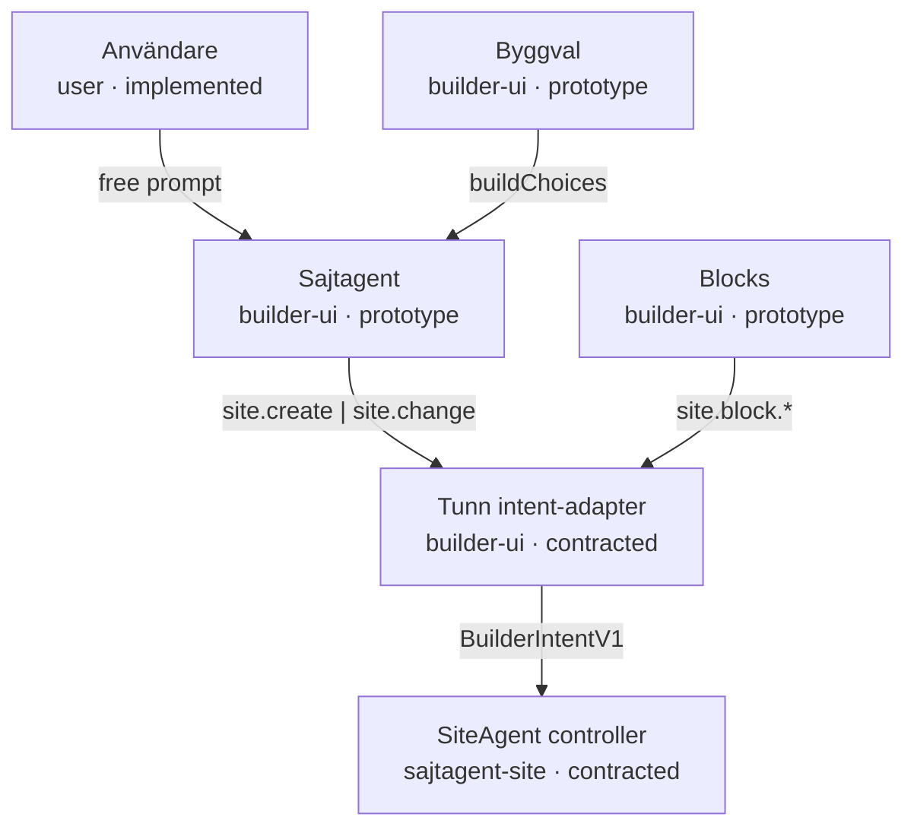
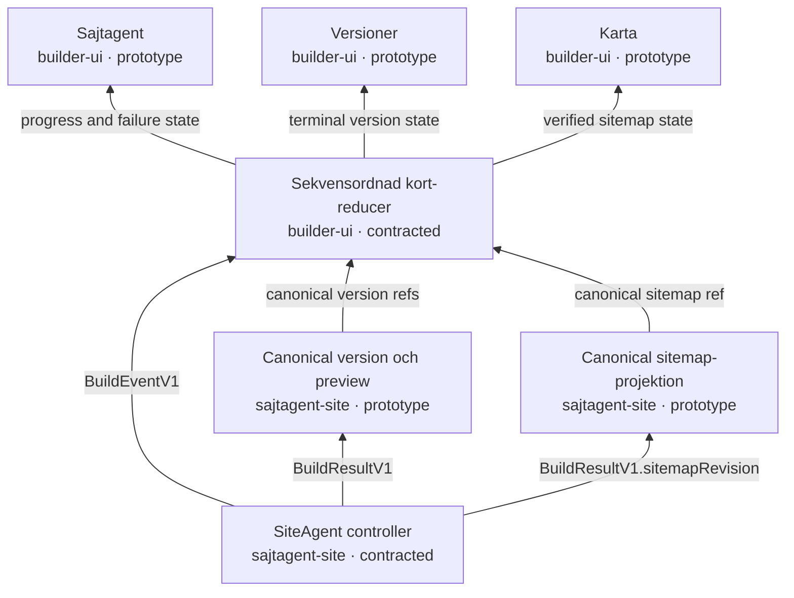
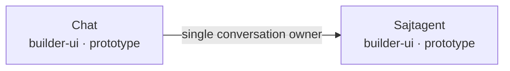

# Builderkortens flöde

<!-- Generated by scripts/verify-card-flow.mjs from system-model/card-flow-v1.json. -->

Den maskinläsbara modellen skiljer på dagens prototyp och målarkitekturen. `face-defs.tsx` är fortfarande det körbara registret; CI stoppar drift mellan registret och modellen.

## Mål: kommando nedåt

## Mål: bevis upp till korten

## Beslut: Chat går in i Sajtagent

## Kortkontrakt

| Kort | Nu | Mål | Producerar | Konsumerar | Felkod |
| --- | --- | --- | --- | --- | --- |
| Byggval | separate prototype card | keep until first verified version | `BuilderIntentV1.context.buildChoices` | - | `card.choices-invalid` |
| Chat | primary prototype build input | merge into agent | `site.create` `site.change` | `message.delta` `job.failed` | `card.chat-merge-drift` |
| Sajtagent | informational prototype | primary builder conversation | `site.create` `site.change` | `job.accepted` `job.running` `message.delta` `job.failed` | `card.agent-unavailable` |
| Blocks | free-text follow-up prototype | typed block intent | `site.block.add` `site.block.replace` `site.block.remove` | `job.failed` | `card.blocks-stale-ref` |
| Versioner | prototype projection | verified read model | - | `job.succeeded` `job.failed` | `card.versions-gap` |
| Karta | preview-pages prototype | verified sitemap read model | - | `job.succeeded` | `card.map-missing` |

## Beslut som tester låser

- Det körbara registret har fortfarande sex kort medan migreringen pågår.
- Målbilden har fem kort: Byggval, Blocks, Versioner, Karta och Sajtagent.
- Chat är det enda fristående kortet som ska absorberas, och målet är Sajtagent.
- Browserkort skapar endast `BuilderIntentV1`; inga OpenClaw-, MCP- eller verktygsnamn får läcka in i kortkontraktet.
- Versioner och Karta projicerar verifierad produktstate och får inte deklarera framgång från råa modell- eller OpenClaw-events.

Ändra `system-model/card-flow-v1.json`, kör `npm run cards:docs`, och verifiera sedan med `npm run cards:check`.
